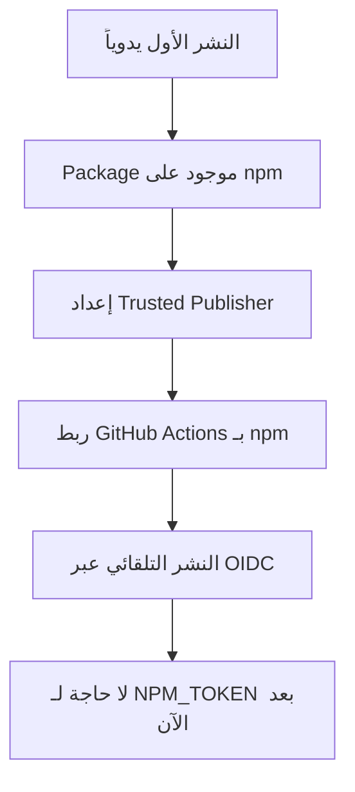

# 🚀 دليل النشر الأول لـ WaQtor على npm

**التاريخ:** 28 أكتوبر 2025  
**الحالة:** 📝 جاهز للنشر

---

## ⚠️ **المشكلة الحالية**

عند محاولة النشر عبر GitHub Actions مع Trusted Publisher:

```
npm error 404 Not Found - PUT https://registry.npmjs.org/waqtor
npm error 'waqtor@1.0.0' is not in this registry.
```

**السبب:**  
npm Trusted Publisher يتطلب أن يكون الـ package **موجوداً بالفعل** على npm قبل استخدام OIDC!

---

## ✅ **الحل: النشر الأول اليدوي**

لديك **خياران** للنشر الأول:

---

### **الخيار 1: النشر من جهازك المحلي** ⭐ (موصى به)

#### **الخطوات:**

```bash
# 1. تأكد أنك مسجل دخول على npm
npm whoami

# إذا لم تكن مسجلاً، سجل الدخول:
npm login
# Username: your-npm-username
# Password: your-npm-password
# Email: your-email@example.com
# OTP (if enabled): xxxxxx

# 2. تأكد من الـ package.json
cat package.json | grep "name\|version"
# يجب أن تظهر:
# "name": "waqtor",
# "version": "1.0.0",

# 3. انشر الـ package
npm publish --access public

# 4. تحقق من النشر
npm info waqtor
```

**المخرجات المتوقعة:**

```bash
+ waqtor@1.0.0
npm notice
npm notice 📦  waqtor@1.0.0
npm notice === Tarball Details ===
npm notice name:          waqtor
npm notice version:       1.0.0
npm notice total files:   74
npm notice
```

---

### **الخيار 2: النشر عبر GitHub Actions مع NPM_TOKEN**

#### **المتطلبات:**

1. ✅ لديك npm token
2. ✅ Token مضاف كـ Secret في GitHub

#### **الخطوات:**

**A. إنشاء NPM Token (إذا لم يكن لديك):**

```bash
# 1. اذهب إلى npmjs.com
https://www.npmjs.com/settings/your-username/tokens

# 2. اضغط "Generate New Token"
# 3. اختر "Automation" token
# 4. انسخ الـ Token (لن تراه مرة أخرى!)
```

**B. إضافة Token إلى GitHub:**

```bash
# 1. اذهب إلى repo settings
https://github.com/tariqsaidofficial/WaQtor/settings/secrets/actions

# 2. اضغط "New repository secret"
# 3. Name: NPM_TOKEN
# 4. Value: [الصق token هنا]
# 5. Add secret
```

**C. تشغيل Workflow:**

```bash
# 1. اذهب إلى GitHub Actions
https://github.com/tariqsaidofficial/WaQtor/actions

# 2. اختر "Publish to npm" workflow
# 3. اضغط "Run workflow"
# 4. Branch: waqtor-dev أو main
# 5. اضغط "Run workflow" الخضراء
```

---

## 🔄 **بعد النشر الأول**

### **الخطوة 1: إعداد npm Trusted Publisher**

```bash
# 1. اذهب إلى package على npm
https://www.npmjs.com/package/waqtor

# 2. Settings → Trusted Publishers
# 3. Add a Trusted Publisher
# 4. اختر GitHub Actions

# 5. املأ النموذج:
Organization: tariqsaidofficial
Repository: WaQtor
Workflow: publish.yml
Environment: npm-publish

# 6. Set up connection ✅
```

### **الخطوة 2: إزالة NPM_TOKEN من Workflow (اختياري)**

بعد إعداد Trusted Publisher، يمكنك إزالة السطور:

```yaml
env:
  NODE_AUTH_TOKEN: ${{ secrets.NPM_TOKEN }}
```

من ملف `.github/workflows/publish.yml`

---

## 🧪 **التحقق من النشر**

### **1. على npm:**

```bash
# تحقق من وجود package
npm view waqtor

# أو
npm info waqtor version

# يجب أن يظهر: 1.0.0
```

### **2. اختبار التثبيت:**

```bash
# أنشئ مجلد اختبار
mkdir test-waqtor && cd test-waqtor
npm init -y

# ثبت waqtor
npm install waqtor

# تحقق من التثبيت
node -e "console.log(require('waqtor'))"
```

### **3. على الموقع:**

زر: https://www.npmjs.com/package/waqtor

يجب أن ترى:
- ✅ Package name: waqtor
- ✅ Version: 1.0.0
- ✅ Description: WaQtor - Smart Automation Engine for WhatsApp
- ✅ README محدث

---

## 📊 **سير العمل الكامل**



---

## ⚡ **الإصدارات المستقبلية**

بعد إعداد Trusted Publisher:

```bash
# 1. حدث version في package.json
npm version patch  # 1.0.0 → 1.0.1
# أو
npm version minor  # 1.0.0 → 1.1.0
# أو
npm version major  # 1.0.0 → 2.0.0

# 2. ارفع التغييرات
git push && git push --tags

# 3. أنشئ GitHub Release
# GitHub → Releases → Create new release
# Tag: v1.0.1
# Publish release ✅

# 4. سيتم النشر تلقائياً! 🎉
```

---

## 🔐 **مقارنة الطرق**

| الميزة | NPM_TOKEN | Trusted Publisher (OIDC) |
|--------|-----------|---------------------------|
| **الأمان** | ⚠️ Token طويل الأجل | ✅ Token قصير الأجل |
| **Provenance** | ❌ لا يوجد | ✅ موقع رقمياً |
| **Setup** | ✅ سهل | ⚠️ يتطلب package موجود |
| **صيانة** | ❌ تدوير يدوي | ✅ تلقائي |
| **شفافية** | ⚠️ محدودة | ✅ كاملة |

---

## 🎯 **الخطوات التالية**

### **الآن:**
1. ✅ انشر v1.0.0 يدوياً (الخيار 1 أو 2)
2. ✅ تحقق من النشر على npm
3. ✅ اختبر التثبيت

### **بعد النشر:**
1. ✅ أعد إعداد Trusted Publisher على npmjs.com
2. ✅ اختبر النشر التلقائي
3. ✅ احذف NPM_TOKEN من workflow (اختياري)

---

## ❓ **الأسئلة الشائعة**

### **Q: لماذا لم ينجح النشر مباشرة عبر Trusted Publisher؟**
**A:** لأن npm تتطلب وجود package على النظام قبل ربط OIDC.

### **Q: هل يمكن استخدام NPM_TOKEN و OIDC معاً؟**
**A:** نعم، كما في الـ workflow الحالي. سيستخدم OIDC إذا كان متاحاً، وإلا سيعود إلى NPM_TOKEN.

### **Q: ماذا بعد النشر الأول؟**
**A:** أعد إعداد Trusted Publisher على npm، وسيعمل النشر التلقائي!

### **Q: هل NPM_TOKEN آمن؟**
**A:** آمن إذا كان GitHub Secret، لكن OIDC أكثر أماناً.

---

## 📞 **الدعم**

إذا واجهت مشاكل:

- 💬 [GitHub Discussions](https://github.com/tariqsaidofficial/WaQtor/discussions)
- 🐛 [Report Issue](https://github.com/tariqsaidofficial/WaQtor/issues)
- 📧 [Email](mailto:support@dxbmark.com)
- ☕ [Buy Me a Coffee](https://buymeacoffee.com/tariqsaidofficial)

---

**آخر تحديث:** 28 أكتوبر 2025  
**الحالة:** ✅ جاهز للنشر الأول
